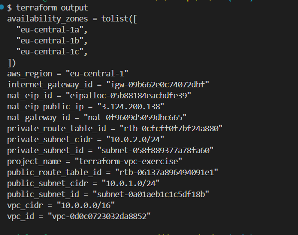
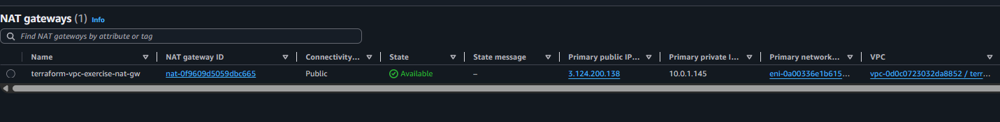
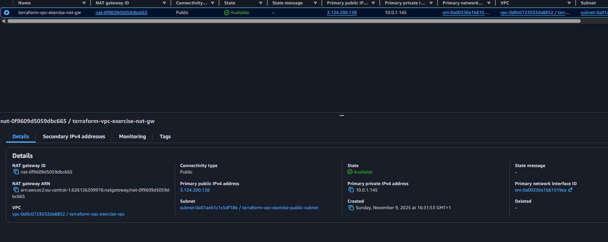
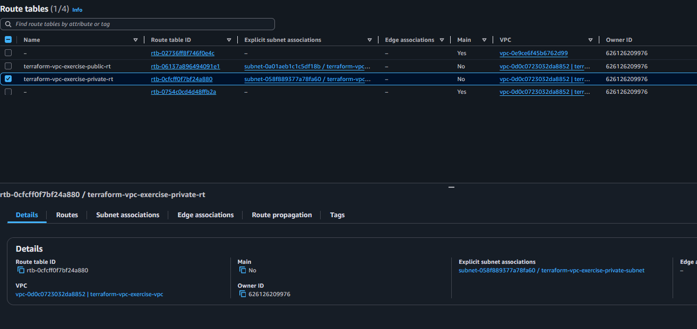
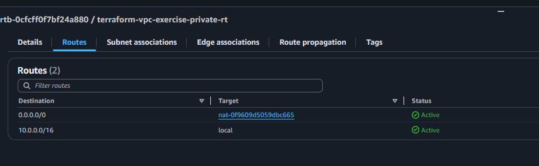
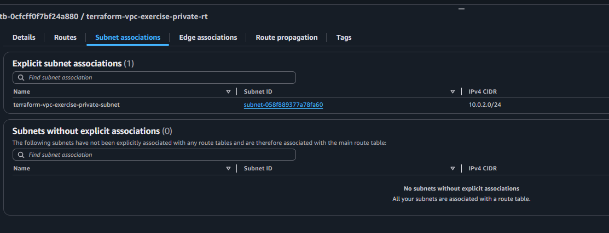

# 🔀 Створення NAT Gateway - Детальні інструкції

## 📋 Огляд кроку

**Мета**: Забезпечити вихідний доступ до інтернету для приватної підмережі  
**Статус**: ✅ Виконано успішно  
**Дата виконання**: 9 листопада 2025  

---

## 🌐 Що таке NAT Gateway?

**NAT Gateway (Network Address Translation Gateway)** - це керований AWS сервіс, який дозволяє інстансам у приватних підмережах підключатися до інтернету або інших сервісів AWS, але запобігає ініціюванню підключень з інтернету до цих інстансів.

### 🎯 Основні функції NAT Gateway:
1. **Односторонній доступ**: Дозволяє тільки вихідний трафік з приватної підмережі
2. **Високий рівень доступності**: AWS автоматично забезпечує резервування
3. **Масштабованість**: Автоматично масштабується до 45 Gbps
4. **Безпека**: Блокує всі вхідні підключення з інтернету

### 🔧 Як працює NAT Gateway:
1. **Розташовується у публічній підмережі** з власною Elastic IP
2. **Маршрутизується через Route Table** (маршрут 0.0.0.0/0 → NAT Gateway)  
3. **Перетворює приватні IP** в свою публічну IP для вихідного трафіку
4. **Відстежує з'єднання** і повертає відповіді до правильних приватних інстансів

### 💡 Важливо розуміти:
- NAT Gateway **платний** - $0.045/годину + $0.045/GB обробленої інформації
- **Один NAT Gateway на AZ** для високої доступності (ми використовуємо один для простоти)
- Потребує **Elastic IP адресу** для роботи
- **Не потребує** адміністрування - це керований сервіс AWS

### ⚖️ NAT Gateway vs NAT Instance:
- **NAT Gateway**: Керований, високодоступний, дорожчий
- **NAT Instance**: Self-managed EC2, дешевший, потребує налаштування

---

## 🎯 Що ми досягли

### Створені ресурси:
1. **Elastic IP**: `eipalloc-05b88184eacbdfe39` (IP: `3.124.200.138`)
2. **NAT Gateway**: `nat-0f9609d5059dbc665`  
3. **Private Route Table**: `rtb-0cfcff0f7bf24a880`
4. **Route Table Association**: `rtbassoc-0f0f79cfdde8ae09c`

### Архітектурна схема:
```
┌─────────────────────────────────────────────────────────┐
│                    Internet                             │
└─────────────────────┬───────────────────────────────────┘
                      │
                ┌─────▼─────┐
                │ Internet  │
                │ Gateway   │ igw-09b662e0c74072dbf
                └─────┬─────┘
                      │
┌─────────────────────▼───────────────────────────────────┐
│              VPC (10.0.0.0/16)                          │
│              vpc-0d0c0723032da8852                      │
│                                                         │
│  ┌─────────────────────────────────────────────────┐    │
│  │         Public Subnet (10.0.1.0/24)             │    │
│  │         subnet-0a01aeb1c1c5df18b                │    │
│  │         AZ: eu-central-1a                       │    │
│  │                                                 │    │
│  │  ┌─────────────────────────────────────────┐    │    │
│  │  │         NAT Gateway                     │    │    │
│  │  │         nat-0f9609d5059dbc665           │    │    │
│  │  │         EIP: 3.124.200.138              │    │    │
│  │  └─────────────────────────────────────────┘    │    │
│  │                                                 │    │
│  │  Route Table: rtb-06137a896494091e1             │    │
│  │  Route: 0.0.0.0/0 → igw-09b662e0c74072dbf       │    │
│  └─────────────────────────────────────────────────┘    │
│                         ▲                               │
│                         │ Outbound traffic              │  
│                         │                               │
│  ┌─────────────────────────────────────────────────┐    │
│  │        Private Subnet (10.0.2.0/24)             │    │
│  │        subnet-058f889377a78fa60                 │    │
│  │        AZ: eu-central-1b                        │    │
│  │        ✅ Internet access via NAT               │    │
│  │                                                 │    │
│  │  Route Table: rtb-0cfcff0f7bf24a880             │    │
│  │  Route: 0.0.0.0/0 → nat-0f9609d5059dbc665       │    │
│  └─────────────────────────────────────────────────┘    │
└─────────────────────────────────────────────────────────┘
```

---

## 💻 Код конфігурації

### 1. Elastic IP для NAT Gateway (в main.tf):
```hcl
# Elastic IP для NAT Gateway
resource "aws_eip" "nat" {
  domain = "vpc"
  
  tags = {
    Name = "${var.project_name}-nat-eip"
  }

  # Залежить від Internet Gateway
  depends_on = [aws_internet_gateway.main]
}
```

### 2. NAT Gateway:
```hcl
# NAT Gateway у публічній підмережі
resource "aws_nat_gateway" "main" {
  allocation_id = aws_eip.nat.id
  subnet_id     = aws_subnet.public.id

  tags = {
    Name = "${var.project_name}-nat-gw"
  }

  # Залежить від Internet Gateway
  depends_on = [aws_internet_gateway.main]
}
```

### 3. Route Table для приватної підмережі:
```hcl
# Route Table для приватної підмережі
resource "aws_route_table" "private" {
  vpc_id = aws_vpc.main.id

  route {
    cidr_block     = "0.0.0.0/0"
    nat_gateway_id = aws_nat_gateway.main.id
  }

  tags = {
    Name = "${var.project_name}-private-rt"
  }
}
```

### 4. Association Route Table з приватною підмережею:
```hcl
# Асоціація Route Table з приватною підмережею
resource "aws_route_table_association" "private" {
  subnet_id      = aws_subnet.private.id
  route_table_id = aws_route_table.private.id
}
```

### 5. Outputs (в outputs.tf):
```hcl
# NAT Gateway Outputs
output "nat_gateway_id" {
  description = "ID NAT Gateway"
  value       = aws_nat_gateway.main.id
}

output "nat_eip_public_ip" {
  description = "Публічний IP адрес NAT Gateway"
  value       = aws_eip.nat.public_ip
}

output "nat_eip_id" {
  description = "ID Elastic IP для NAT Gateway"
  value       = aws_eip.nat.id
}

output "private_route_table_id" {
  description = "ID Route Table для приватної підмережі"
  value       = aws_route_table.private.id
}
```

---

## 🔧 Команди виконання

### 1. Планування змін:
```bash
terraform plan
```

### 2. Застосування змін:
```bash
terraform apply -auto-approve
```

### 3. Перевірка outputs:
```bash
terraform output
```

**Результат**:
```
nat_gateway_id = "nat-0f9609d5059dbc665"
nat_eip_public_ip = "3.124.200.138"
nat_eip_id = "eipalloc-05b88184eacbdfe39"
private_route_table_id = "rtb-0cfcff0f7bf24a880"
```



---

## 🔍 Перевірка в AWS Console

### 1. Перевірка NAT Gateway:
- **Перехід**: VPC → NAT Gateways
- **ID**: `nat-0f9609d5059dbc665`
- **Статус**: Available
- **Elastic IP**: `3.124.200.138`
- **Subnet**: `subnet-0a01aeb1c1c5df18b` (Public)



### 2. Перевірка Elastic IP:
- **Перехід**: EC2 → Elastic IPs
- **Allocation ID**: `eipalloc-05b88184eacbdfe39`
- **Public IP**: `3.124.200.138`
- **Associated**: NAT Gateway `nat-0f9609d5059dbc665`




### 3. Перевірка Private Route Table:
- **Перехід**: VPC → Route Tables
- **ID**: `rtb-0cfcff0f7bf24a880`
- **Routes**: 
  - `10.0.0.0/16` → local
  - `0.0.0.0/0` → `nat-0f9609d5059dbc665`




### 4. Перевірка Subnet Associations:
- **Route Table**: `rtb-0cfcff0f7bf24a880`
- **Associated Subnets**: `subnet-058f889377a78fa60` (Private)



---

## ✅ Результат

### Що досягнуто:
1. ✅ **Elastic IP створено** (`3.124.200.138`) і виділено для NAT Gateway
2. ✅ **NAT Gateway створено** у публічній підмережі з високою доступністю  
3. ✅ **Route Table налаштовано** для приватної підмережі
4. ✅ **Маршрутизація налаштована** (0.0.0.0/0 → NAT Gateway)
5. ✅ **Приватна підмережа отримала вихідний доступ до інтернету**

### Переваги поточної архітектури:
- 🔒 **Безпека**: Приватні інстанси недоступні з інтернету
- 🌐 **Зв'язок**: Приватні інстанси можуть оновлюватися та завантажувати дані
- 📊 **Моніторинг**: Весь трафік проходить через один контрольований NAT Gateway
- ⚡ **Продуктивність**: Керований AWS сервіс з автоматичним масштабуванням

### Наступний крок:
🛡️ **Крок 6**: Налаштування Security Groups для контролю трафіку

---

## 💰 Вартість

**NAT Gateway** коштує:
- **$0.045 за годину** роботи
- **$0.045 за GB** обробленої інформації
- **Elastic IP**: Безкоштовно поки використовується

**Орієнтовна вартість**: ~$32/місяць для постійної роботи

---

## 🔗 Корисні посилання

- [AWS NAT Gateway Documentation](https://docs.aws.amazon.com/vpc/latest/userguide/vpc-nat-gateway.html)
- [Terraform aws_nat_gateway](https://registry.terraform.io/providers/hashicorp/aws/latest/docs/resources/nat_gateway)
- [AWS NAT Gateway Pricing](https://aws.amazon.com/vpc/pricing/)
- [NAT Gateway vs NAT Instance Comparison](https://docs.aws.amazon.com/vpc/latest/userguide/vpc-nat-comparison.html)