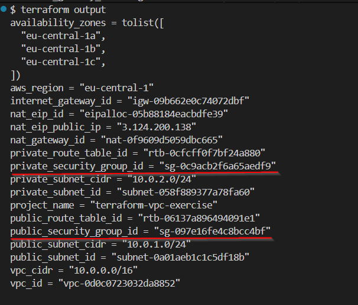
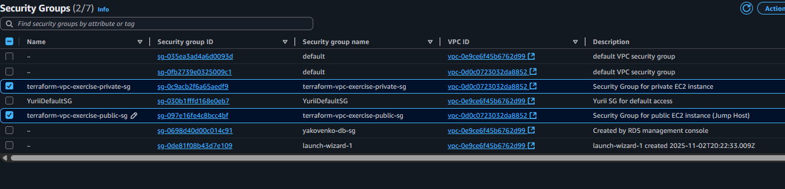
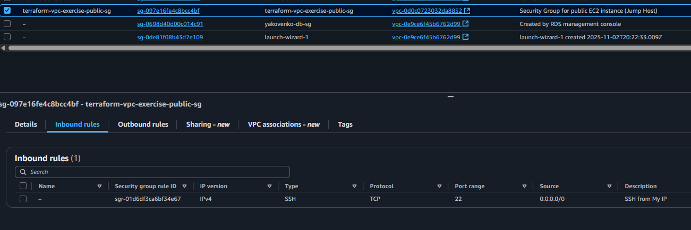
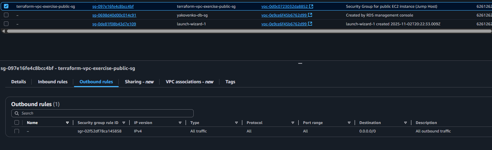
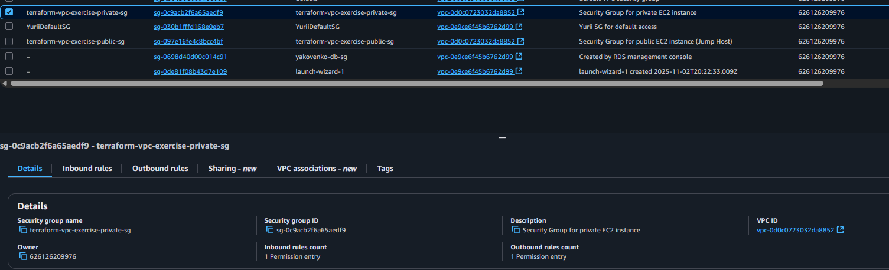
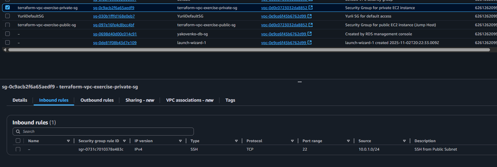
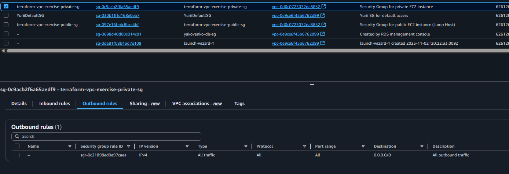

# 🛡️ Створення Security Groups - Детальні інструкції

## 📋 Огляд кроку

**Мета**: Налаштувати правила безпеки для EC2 інстансів  
**Статус**: ✅ Виконано успішно  
---

## 🔒 Що таке Security Groups?

**Security Groups** - це віртуальні фаєрволи на рівні інстансу, які контролюють вхідний та вихідний трафік до EC2 інстансів. Вони працюють як "охоронці" які перевіряють кожен пакет даних.

### 🎯 Ключові особливості Security Groups:
1. **Stateful** - автоматично дозволяють відповідь на дозволений вхідний трафік
2. **Deny by default** - за замовчуванням все заборонено
3. **Allow rules only** - можна тільки дозволяти, не забороняти
4. **Instance level** - діють на рівні мережевого інтерфейсу EC2

### 🔧 Правила Security Groups:
- **Ingress rules** - контролюють **вхідний** трафік (що може потрапити до інстансу)
- **Egress rules** - контролюють **вихідний** трафік (що може вийти з інстансу)

### 💡 Важливо розуміти:
- Один інстанс може мати **декілька Security Groups**
- Правила **додаються** (не перевизначаються)
- Зміни застосовуються **миттєво**
- **Немає порядку правил** - всі правила перевіряються одночасно

---

## 🎯 Архітектура Security Groups для нашого проекту

### 📊 Принцип мінімальних привілеїв:
Відповідно до завдання, нам потрібно тільки SSH доступ, тому ми створюємо мінімалістичну конфігурацію.

```
┌─────────────────────────────────────────────────────────┐
│                    Internet                             │
│                   0.0.0.0/0                             │  
└─────────────────────┬───────────────────────────────────┘
                      │ SSH (22)
                      ▼
┌─────────────────────────────────────────────────────────┐
│              VPC (10.0.0.0/16)                          │
│                                                         │
│  ┌─────────────────────────────────────────────────┐    │
│  │         Public Subnet (10.0.1.0/24)             │    │
│  │                                                 │    │
│  │  ┌─────────────────────────────────────────┐    │    │
│  │  │        Public EC2 (Jump Host)           │    │    │
│  │  │    Security Group: sg-097e16fe4c8bcc4bf │    │    │
│  │  │    ✅ SSH (22) ← 0.0.0.0/0              │    │    │
│  │  │    ✅ All traffic → 0.0.0.0/0           │    │    │
│  │  └─────────────────────────────────────────┘    │    │
│  └─────────────────────────────────────────────────┘    │
│                         │ SSH (22)                      │
│                         ▼                               │
│  ┌─────────────────────────────────────────────────┐    │
│  │        Private Subnet (10.0.2.0/24)             │    │
│  │                                                 │    │
│  │  ┌─────────────────────────────────────────┐    │    │
│  │  │         Private EC2                     │    │    │
│  │  │    Security Group: sg-0c9acb2f6a65aedf9 │    │    │
│  │  │    ✅ SSH (22) ← 10.0.1.0/24            │    │    │
│  │  │    ✅ All traffic → 0.0.0.0/0           │    │    │
│  │  └─────────────────────────────────────────┘    │    │
│  └─────────────────────────────────────────────────┘    │
└─────────────────────────────────────────────────────────┘
```

---

## 🎯 Що створили

### 🌐 **Public Security Group** (`sg-097e16fe4c8bcc4bf`):
- **Назва**: `terraform-vpc-exercise-public-sg`
- **Призначення**: Jump Host / Bastion Server

**Ingress Rules (вхідний трафік):**
```hcl
# SSH доступ з інтернету
ingress {
  description = "SSH from My IP"
  from_port   = 22
  to_port     = 22
  protocol    = "tcp"
  cidr_blocks = ["0.0.0.0/0"]  # Доступ з будь-якої IP адреси
}
```

**Egress Rules (вихідний трафік):**
```hcl
# Повний доступ до інтернету
egress {
  description = "All outbound traffic"
  from_port   = 0
  to_port     = 0
  protocol    = "-1"           # Всі протоколи
  cidr_blocks = ["0.0.0.0/0"]  # До будь-яких адрес
}
```

### 🔒 **Private Security Group** (`sg-0c9acb2f6a65aedf9`):
- **Назва**: `terraform-vpc-exercise-private-sg`  
- **Призначення**: Приватний сервер (Database/Backend)

**Ingress Rules (вхідний трафік):**
```hcl
# SSH тільки з публічної підмережі  
ingress {
  description = "SSH from Public Subnet"
  from_port   = 22
  to_port     = 22
  protocol    = "tcp"
  cidr_blocks = ["10.0.1.0/24"]  # Тільки з публічної підмережі!
}
```

**Egress Rules (вихідний трафік):**
```hcl
# Повний вихідний доступ (через NAT Gateway)
egress {
  description = "All outbound traffic"
  from_port   = 0
  to_port     = 0
  protocol    = "-1"
  cidr_blocks = ["0.0.0.0/0"]  # Для оновлень через NAT
}
```

---

## 💻 Код конфігурації

### 1. Public Security Group (в main.tf):
```hcl
# Security Group для публічного EC2 (Jump Host / Bastion)
resource "aws_security_group" "public_ec2" {
  name        = "${var.project_name}-public-sg"
  description = "Security Group for public EC2 instance (Jump Host)"
  vpc_id      = aws_vpc.main.id

  # SSH доступ з вашої IP адреси
  ingress {
    description = "SSH from My IP"
    from_port   = 22
    to_port     = 22
    protocol    = "tcp"
    cidr_blocks = ["0.0.0.0/0"] # УВАГА: замініть на вашу IP для безпеки
  }

  # Весь вихідний трафік
  egress {
    description = "All outbound traffic"
    from_port   = 0
    to_port     = 0
    protocol    = "-1"
    cidr_blocks = ["0.0.0.0/0"]
  }

  tags = {
    Name = "${var.project_name}-public-sg"
    Type = "Public"
  }
}
```

### 2. Private Security Group:
```hcl
# Security Group для приватного EC2
resource "aws_security_group" "private_ec2" {
  name        = "${var.project_name}-private-sg"
  description = "Security Group for private EC2 instance"
  vpc_id      = aws_vpc.main.id

  # SSH тільки з публічної підмережі (Jump Host)
  ingress {
    description = "SSH from Public Subnet"
    from_port   = 22
    to_port     = 22
    protocol    = "tcp"
    cidr_blocks = ["10.0.1.0/24"]
  }

  # Весь вихідний трафік (для оновлень через NAT)
  egress {
    description = "All outbound traffic"
    from_port   = 0
    to_port     = 0
    protocol    = "-1"
    cidr_blocks = ["0.0.0.0/0"]
  }

  tags = {
    Name = "${var.project_name}-private-sg"
    Type = "Private"
  }
}
```

### 3. Outputs (в outputs.tf):
```hcl
# Security Groups Outputs
output "public_security_group_id" {
  description = "ID Security Group для публічного EC2"
  value       = aws_security_group.public_ec2.id
}

output "private_security_group_id" {
  description = "ID Security Group для приватного EC2"
  value       = aws_security_group.private_ec2.id
}
```

---

## 🔧 Команди виконання

### 1. Планування змін:
```bash
terraform plan
```

### 2. Застосування змін:
```bash
terraform apply -auto-approve
```

**⚠️ Важливо**: Першу спробу може не вдатися через кирилицю в описах. Потрібно замінити на англійські описи.

### 3. Перевірка outputs:
```bash
terraform output
```

**Результат**:
```
public_security_group_id = "sg-097e16fe4c8bcc4bf"
private_security_group_id = "sg-0c9acb2f6a65aedf9"
```



---

## 🔍 Перевірка в AWS Console

### 1. Перевірка Security Groups:
- **Перехід**: EC2 → Security Groups
- **Фільтр**: VPC = `vpc-0d0c0723032da8852`



### 2. Перевірка Public Security Group:
- **ID**: `sg-097e16fe4c8bcc4bf`
- **Name**: `terraform-vpc-exercise-public-sg`
- **Inbound rules**: SSH (22) from 0.0.0.0/0
- **Outbound rules**: All traffic to 0.0.0.0/0





### 3. Перевірка Private Security Group:
- **ID**: `sg-0c9acb2f6a65aedf9`
- **Name**: `terraform-vpc-exercise-private-sg`  
- **Inbound rules**: SSH (22) from 10.0.1.0/24
- **Outbound rules**: All traffic to 0.0.0.0/0





---

## 🔐 Аналіз безпеки

### ✅ Що добре в нашій конфігурації:
1. **Принцип мінімальних привілеїв** - тільки необхідні порти
2. **Layered security** - приватний інстанс захищений подвійно
3. **No direct access** - приватний сервер недоступний з інтернету
4. **Controlled access** - доступ тільки через Jump Host

### ⚠️ Рекомендації для production:
1. **Обмежити SSH доступ** - замість `0.0.0.0/0` використати вашу IP:
   ```hcl
   cidr_blocks = ["YOUR_IP/32"]  # Замість 0.0.0.0/0
   ```

2. **Використати Key Pairs** - тільки SSH ключі, не паролі

3. **Додати моніторинг** - CloudTrail, VPC Flow Logs

4. **Регулярні ротації** - SSH ключів та Security Groups

---

## 📊 Тестування Security Groups

### 🧪 Що можна буде протестувати (після створення EC2):

#### 1. **SSH до публічного інстансу** ✅
```bash
ssh -i key.pem ec2-user@<public-ip>
```
**Очікуваний результат**: Успішне підключення

#### 2. **SSH до приватного інстансу з інтернету** ❌
```bash
ssh -i key.pem ec2-user@<private-ip>  # Має НЕ працювати
```
**Очікуваний результат**: Connection timeout (заблоковано Security Group)

#### 3. **SSH до приватного інстансу через Jump Host** ✅
```bash
ssh -i key.pem -J ec2-user@<public-ip> ec2-user@<private-ip>
```
**Очікуваний результат**: Успішне підключення через Jump Host

---

## ✅ Результат

### Що досягнуто:
1. ✅ **Public Security Group створено** з мінімальними правилами доступу
2. ✅ **Private Security Group створено** з обмеженим доступом тільки з Jump Host
3. ✅ **Архітектура безпеки налаштована** згідно з принципами least privilege  
4. ✅ **Готовність до створення EC2** - Security Groups готові для прикріплення

### Архітектурні переваги:
- 🔒 **Захист приватного сервера** - недоступний з інтернету
- 🚪 **Контрольована точка входу** - тільки через Jump Host
- 🛡️ **Мінімальна поверхня атаки** - тільки необхідні порти відкриті
- ⚡ **Простота управління** - зрозуміла та чітка конфігурація

### Наступний крок:
🖥️ **Крок 7**: Створення EC2 інстансів з прикріпленням Security Groups

---

## 💰 Вартість

**Security Groups** - **безкоштовні**! 🎉
- Немає додаткових витрат за створення або використання
- Витрати тільки за EC2 інстанси які будуть використовувати ці Security Groups

---

## 🔗 Корисні посилання

- [AWS Security Groups Documentation](https://docs.aws.amazon.com/vpc/latest/userguide/VPC_SecurityGroups.html)
- [Terraform aws_security_group](https://registry.terraform.io/providers/hashicorp/aws/latest/docs/resources/security_group)
- [AWS Security Best Practices](https://docs.aws.amazon.com/security/aws-security-best-practices/)
- [SSH Jump Host Setup](https://wiki.gentoo.org/wiki/SSH_jump_host)