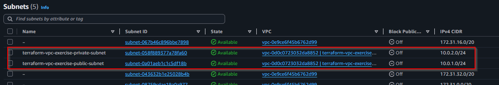
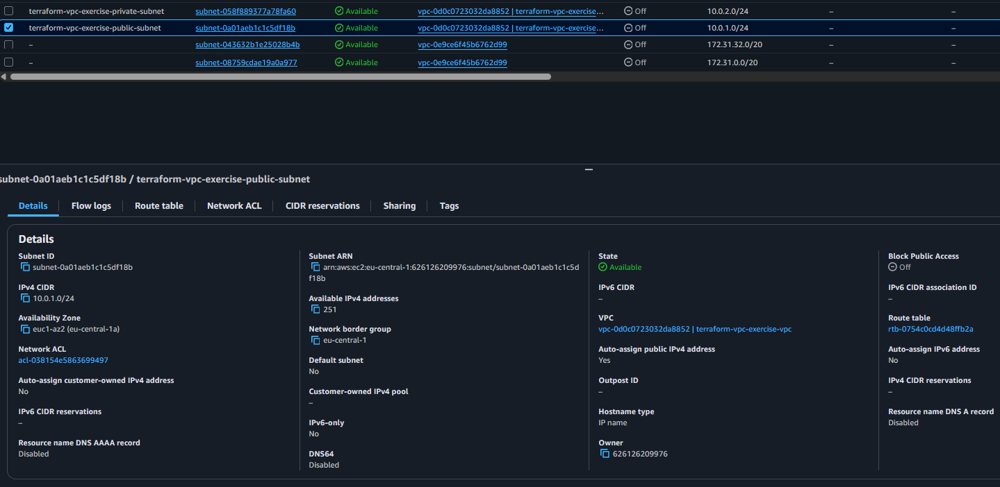
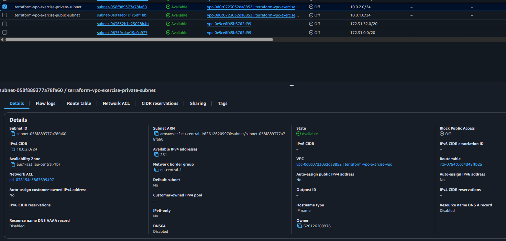
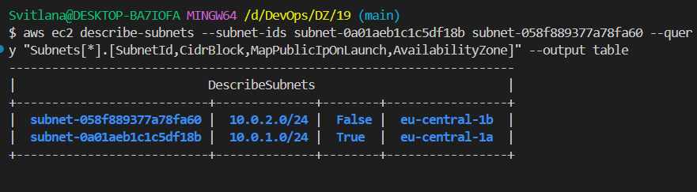

# Створення підмереж (Subnets) за допомогою Terraform

## 🎯 Мета
Створити публічну та приватну підмережі у існуючому VPC з перевіркою результату в AWS Console.

## 🔧 Передумови
Переконайтеся, що виконано:
- [ ] VPC створений: `vpc-0d0c0723032da8852`
- [ ] `export AWS_PROFILE=sk-terraform-user`
- [ ] `terraform plan` працює без помилок

## 📝 Крок 1: Додавання ресурсів підмереж

### 1.1 Редагування main.tf
Додайте до `main.tf` після VPC ресурсу:

```hcl
# Публічна підмережа
resource "aws_subnet" "public" {
  vpc_id                  = aws_vpc.main.id
  cidr_block              = var.public_subnet_cidr
  availability_zone       = data.aws_availability_zones.available.names[0]
  map_public_ip_on_launch = true

  tags = {
    Name = "${var.project_name}-public-subnet"
    Type = "Public"
  }
}

# Приватна підмережа
resource "aws_subnet" "private" {
  vpc_id            = aws_vpc.main.id
  cidr_block        = var.private_subnet_cidr
  availability_zone = data.aws_availability_zones.available.names[1]

  tags = {
    Name = "${var.project_name}-private-subnet"
    Type = "Private"
  }
}
```

**Пояснення параметрів:**
- `vpc_id` - прив'язка до створеного VPC
- `cidr_block` - IP діапазон підмережі (10.0.1.0/24 та 10.0.2.0/24)
- `availability_zone` - різні зони для надійності (eu-central-1a та 1b)
- `map_public_ip_on_launch = true` - **КРИТИЧНО** для публічної підмережі!

### 1.2 Перевірка змінних у variables.tf
Переконайтеся що є змінні для CIDR блоків:

```hcl
variable "public_subnet_cidr" {
  description = "CIDR блок для публічної підмережі"
  type        = string
  default     = "10.0.1.0/24"
}

variable "private_subnet_cidr" {
  description = "CIDR блок для приватної підмережі"  
  type        = string
  default     = "10.0.2.0/24"
}
```

### 1.3 Додавання outputs для підмереж
Додайте до `outputs.tf`:

```hcl
# Subnet Outputs
output "public_subnet_id" {
  description = "ID публічної підмережі"
  value       = aws_subnet.public.id
}

output "private_subnet_id" {
  description = "ID приватної підмережі"
  value       = aws_subnet.private.id
}

output "public_subnet_cidr" {
  description = "CIDR блок публічної підмережі"
  value       = aws_subnet.public.cidr_block
}

output "private_subnet_cidr" {
  description = "CIDR блок приватної підмережі"
  value       = aws_subnet.private.cidr_block
}
```

## 🚀 Крок 2: Виконання Terraform команд

### 2.1 Перевірка плану
```bash
terraform plan
```

**Очікуваний вивід:**
```
Plan: 2 to add, 0 to change, 0 to destroy.

# aws_subnet.public will be created
+ resource "aws_subnet" "public" {
    + cidr_block              = "10.0.1.0/24"
    + availability_zone       = "eu-central-1a"
    + map_public_ip_on_launch = true
    + vpc_id                  = "vpc-0d0c0723032da8852"
    + tags = {
        + "Name" = "terraform-vpc-exercise-public-subnet"
        + "Type" = "Public"
      }
    # ... інші атрибути
  }

# aws_subnet.private will be created  
+ resource "aws_subnet" "private" {
    + cidr_block              = "10.0.2.0/24"
    + availability_zone       = "eu-central-1b"
    + map_public_ip_on_launch = false
    + vpc_id                  = "vpc-0d0c0723032da8852"
    + tags = {
        + "Name" = "terraform-vpc-exercise-private-subnet"
        + "Type" = "Private"
      }
    # ... інші атрибути
  }
```

### 2.2 Застосування змін
```bash
terraform apply -auto-approve
```

**Очікуваний результат:**
```
aws_subnet.public: Creating...
aws_subnet.private: Creating...
aws_subnet.private: Creation complete after 0s [id=subnet-058f889377a78fa60]
aws_subnet.public: Creation complete after 11s [id=subnet-0a01aeb1c1c5df18b]

Apply complete! Resources: 2 added, 0 changed, 0 destroyed.

Outputs:
public_subnet_id = "subnet-0a01aeb1c1c5df18b"
private_subnet_id = "subnet-058f889377a78fa60"
public_subnet_cidr = "10.0.1.0/24"
private_subnet_cidr = "10.0.2.0/24"
```

## ✅ Крок 3: Перевірка в AWS Console

### 3.1 Відкрийте AWS Console
1. Перейдіть на https://console.aws.amazon.com/
2. У пошуку введіть "VPC"
3. Перейдіть до **Subnets** в лівому меню

### 3.2 Знайдіть створені підмережі

**📸 СКРІНШОТ 7.1**: Загальний список підмереж



**Що ви повинні бачити:**
- ✅ `terraform-vpc-exercise-public-subnet` 
- ✅ `terraform-vpc-exercise-private-subnet`
- ✅ Обидві у VPC `vpc-0d0c0723032da8852`
- ✅ Різні Availability Zones

### 3.3 Перевірка деталей Public Subnet

Клікніть на `terraform-vpc-exercise-public-subnet`:

**📸 СКRÍНШОТ 7.2**: Деталі публічної підмережі



**Критичні параметри:**
- ✅ **Auto-assign public IPv4 address**: `Yes` 
- ✅ **IPv4 CIDR**: `10.0.1.0/24`
- ✅ **Availability Zone**: `eu-central-1a`
- ✅ **VPC**: `vpc-0d0c0723032da8852`

### 3.4 Перевірка деталей Private Subnet

Клікніть на `terraform-vpc-exercise-private-subnet`:

**📸 СКРІНШОТ 7.3**: Деталі приватної підмережі



**Критичні параметри:**
- ✅ **Auto-assign public IPv4 address**: `No`
- ✅ **IPv4 CIDR**: `10.0.2.0/24`  
- ✅ **Availability Zone**: `eu-central-1b`
- ✅ **VPC**: `vpc-0d0c0723032da8852`

### 3.5 Порівняння підмереж

**📸 СКРІНШОТ 7.4**: Порівняння налаштувань підмереж

```
aws ec2 describe-subnets --subnet-ids subnet-0a01aeb1c1c5df18b subnet-058f889377a78fa60 --query "Subnets[*].[SubnetId,CidrBlock,MapPublicIpOnLaunch,AvailabilityZone]" --output table
```



## 🎯 Що було створено

### AWS ресурси:
1. **Public Subnet** - `subnet-0a01aeb1c1c5df18b`
   - CIDR: 10.0.1.0/24 (251 IP адреса)
   - Auto-assign public IP: **Увімкнено**
   - AZ: eu-central-1a

2. **Private Subnet** - `subnet-058f889377a78fa60`
   - CIDR: 10.0.2.0/24 (251 IP адреса)  
   - Auto-assign public IP: **Вимкнено**
   - AZ: eu-central-1b

### Terraform файли:
- ✅ `main.tf` - додано 2 subnet ресурси
- ✅ `outputs.tf` - додано subnet outputs
- ✅ `terraform.tfstate` - оновлений стан (збережений в S3)

## 🔄 Різниця між Public та Private підмережами

| Параметр                  | Public Subnet               | Private Subnet            |
|---------------------------|-----------------------------|---------------------------|
| **Auto-assign Public IP** | ✅ Yes                     | ❌ No                     |
| **Доступ з інтернету**    | ⏳ Після IGW + Routes      | ❌ Ніколи                 |
| **Доступ до інтернету**   | ⏳ Після IGW + Routes      | ⏳ Після NAT Gateway      |
| **Призначення**           | Web сервери, Load Balancers | Database, Backend сервіси |

## 📊 Наступні кроки

Тепер у нас є підмережі, але вони ще **НЕ підключені до інтернету**. Наступні кроки:

1. **Internet Gateway** - для доступу публічної підмережі до інтернету
2. **Route Tables** - для маршрутизації трафіку
3. **NAT Gateway** - для вихідного доступу приватної підмережі
4. **Security Groups** - правила безпеки
5. **EC2 Instances** - віртуальні сервери

---

## 🔍 Команди для перевірки

```bash
# Переглянути поточний стан
terraform show

# Переглянути тільки outputs
terraform output

# Перевірити підмережі через AWS CLI
aws ec2 describe-subnets --filters "Name=vpc-id,Values=vpc-0d0c0723032da8852"
```