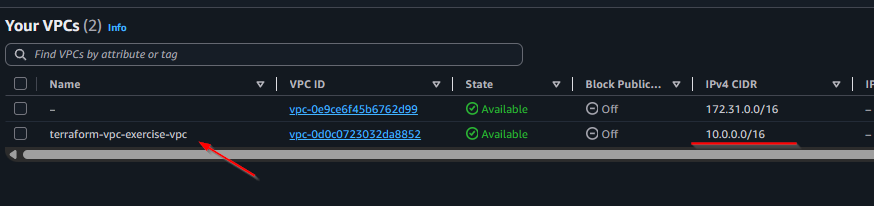

# Створення VPC за допомогою Terraform

## 🎯 Мета
Створити базовий VPC (Virtual Private Cloud) в AWS за допомогою Terraform з перевіркою результату в AWS Console.

## 🔧 Передумови
Переконайтеся, що виконано:
- [ ] `export AWS_PROFILE=sk-terraform-user`
- [ ] `terraform init` успішний
- [ ] `terraform plan` працює без помилок

## 📝 Крок 1: Додавання VPC ресурсу

### 1.1 Редагування vpc.tf
Створіть новий файл `vpc.tf` з ресурсом:

```hcl
# ========================================
# VPC RESOURCES  
# ========================================

# Основний VPC
resource "aws_vpc" "main" {
  cidr_block           = var.vpc_cidr
  enable_dns_hostnames = true
  enable_dns_support   = true

  tags = {
    Name = "${var.project_name}-vpc"
  }
}
```

**Пояснення параметрів:**
- `cidr_block = var.vpc_cidr` - використовує змінну з `variables.tf` (10.0.0.0/16)
- `enable_dns_hostnames = true` - дозволяє DNS імена для інстансів
- `enable_dns_support = true` - увімкає DNS резолюцію
- `tags.Name` - створює зручну назву для AWS Console

### 1.2 Додавання outputs для VPC

Додайте до `outputs.tf`:

```hcl
# VPC Outputs
output "vpc_id" {
  description = "ID створеного VPC"
  value       = aws_vpc.main.id
}

output "vpc_cidr" {
  description = "CIDR блок VPC"
  value       = aws_vpc.main.cidr_block
}
```

## 🚀 Крок 2: Виконання Terraform команд

### 2.1 Перевірка плану
```bash
terraform plan
```

**Очікуваний вивід:**
```
Plan: 1 to add, 0 to change, 0 to destroy.

# aws_vpc.main will be created
+ resource "aws_vpc" "main" {
    + cidr_block           = "10.0.0.0/16"
    + enable_dns_hostnames = true
    + enable_dns_support   = true
    + tags                 = {
        + "Name" = "terraform-vpc-exercise-vpc"
      }
    # ... інші атрибути
  }
```

### 2.2 Застосування змін
```bash
terraform apply -auto-approve
```

**Очікуваний результат:**
```
aws_vpc.main: Creating...
aws_vpc.main: Creation complete after 12s [id=vpc-0d0c0723032da8852]

Apply complete! Resources: 1 added, 0 changed, 0 destroyed.

Outputs:
vpc_cidr = "10.0.0.0/16"
vpc_id = "vpc-0d0c0723032da8852"
```

## ✅ Крок 3: Перевірка в AWS Console

### 3.1 Відкрийте AWS Console
1. Перейдіть на https://console.aws.amazon.com/
2. У пошуку введіть "VPC"
3. Перейдіть до VPC Dashboard

### 3.2 Знайдіть створений VPC
Шукайте VPC з такими характеристиками:

| Параметр        | Значення                     |
|-----------------|------------------------------|
| **Name**        | `terraform-vpc-exercise-vpc` |
| **VPC ID**      | `vpc-0d0c0723032da8852`      |
| **IPv4 CIDR**   | `10.0.0.0/16`                |
| **State**       | Available                    |
| **Default VPC** | No                           |

### 3.3 Результат перевірки

**📸 СКРІНШОТ**: AWS Console з створеним VPC



**Що ви повинні бачити на скріншоті:**
- ✅ VPC зі статусом "Available" 
- ✅ Правильна назва `terraform-vpc-exercise-vpc`
- ✅ CIDR блок `10.0.0.0/16`
- ✅ VPC ID співпадає з output Terraform

## 🎯 Що було створено

### AWS ресурси:
1. **VPC** - основна віртуальна мережа
   - CIDR: 10.0.0.0/16 (65536 IP адрес)
   - DNS підтримка увімкнена
   - DNS hostnames увімкнені

### Terraform файли:
- ✅ `vpc.tf` - створено файл з aws_vpc ресурсом
- ✅ `outputs.tf` - додано VPC outputs
- ✅ `terraform.tfstate` - оновлений стан (збережений в S3)

## 📊 Наступні кроки

Тепер у нас є базовий VPC. Наступні кроки:

1. **Підмережі (Subnets)** - публічна та приватна
2. **Internet Gateway** - для доступу до інтернету
3. **NAT Gateway** - для приватних інстансів
4. **Route Tables** - маршрутизація трафіку
5. **Security Groups** - правила безпеки
6. **EC2 Instances** - віртуальні сервери

---

## 🔍 Команди для перевірки

```bash
# Переглянути поточний стан
terraform show

# Переглянути тільки outputs
terraform output

# Перевірити VPC через AWS CLI
aws ec2 describe-vpcs --vpc-ids vpc-0d0c0723032da8852
```