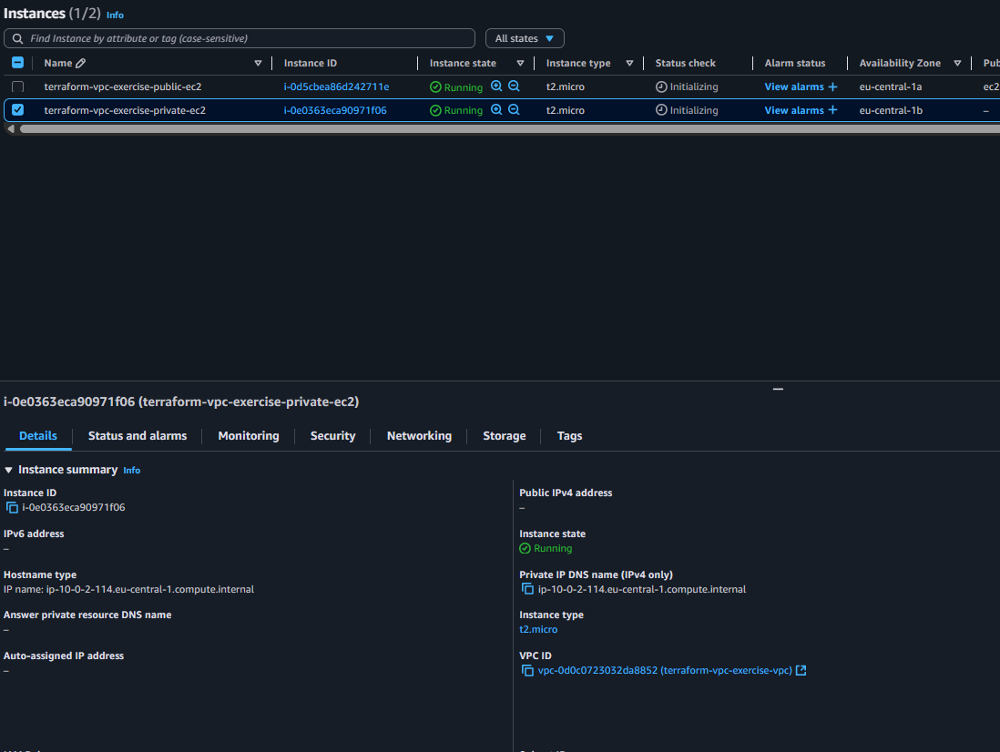
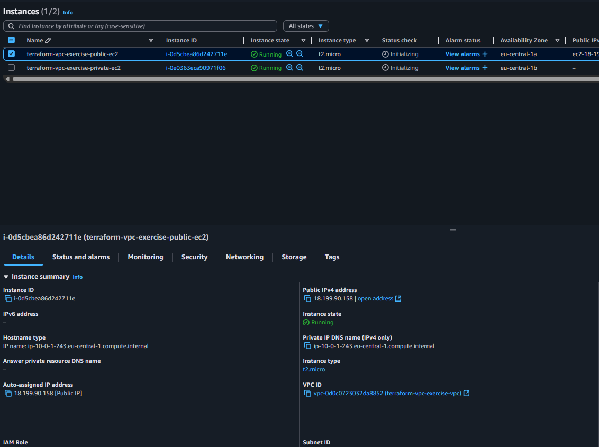
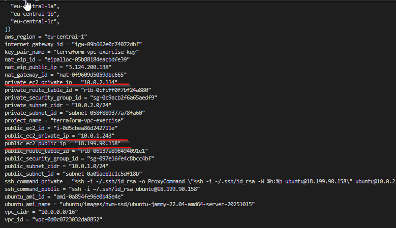

# Step 7: Створення EC2 Instances з Ubuntu

## 🎯 Мета
Створити два EC2 instances з Ubuntu 22.04 LTS:
- **Public EC2** у публічній підмережі (Jump Host/Bastion)
- **Private EC2** у приватній підмережі (Backend Server)

## 🏗️ Архітектура EC2 Instances

```
Internet
    │
    │ SSH (Port 22)
    ▼
┌─────────────────────────────┐
│     Public Subnet           │
│   (10.0.1.0/24)             │
│                             │
│  ┌─────────────────────┐    │
│  │   Public EC2        │    │
│  │   (Jump Host)       │    │◄─── SSH з Internet
│  │ 🌐 18.199.90.158    │   │
│  │ 🏠 10.0.1.243       │   │
│  └─────────────────────┘    │
└─────────────┬───────────────┘
              │ SSH (Port 22)
              │ тільки з Public Subnet
              ▼
┌─────────────────────────────┐
│     Private Subnet          │
│   (10.0.2.0/24)             │
│                             │
│  ┌─────────────────────┐    │
│  │   Private EC2       │    │
│  │  (Backend Server)   │    │◄─── SSH тільки з Jump Host
│  │ 🏠 10.0.2.114       │   │
│  └─────────────────────┘    │
│              │              │
│              ▼              │
│         NAT Gateway         │◄─── Internet доступ для оновлень
└─────────────────────────────┘
```

## 📋 Компоненти для створення

### 1. 🔑 SSH Key Pair
```hcl
resource "aws_key_pair" "main" {
  key_name   = "${var.project_name}-key"
  public_key = var.public_key_content
}
```

### 2. 🔍 Ubuntu AMI Data Source
```hcl
data "aws_ami" "ubuntu" {
  most_recent = true
  owners      = ["099720109477"] # Canonical
  
  filter {
    name   = "name"
    values = ["ubuntu/images/hvm-ssd/ubuntu-jammy-22.04-amd64-server-*"]
  }
  
  filter {
    name   = "virtualization-type"  
    values = ["hvm"]
  }
}
```

### 3. 🌐 Public EC2 Instance (Jump Host)
```hcl
resource "aws_instance" "public" {
  ami                    = data.aws_ami.ubuntu.id
  instance_type          = var.instance_type
  key_name               = aws_key_pair.main.key_name
  vpc_security_group_ids = [aws_security_group.public_ec2.id]
  subnet_id              = aws_subnet.public.id

  user_data_base64 = base64encode(<<-EOF
              #!/bin/bash
              apt-get update
              apt-get install -y htop curl wget
              echo "Public EC2 (Jump Host) - Ready!" > /home/ubuntu/server-info.txt
              chown ubuntu:ubuntu /home/ubuntu/server-info.txt
              EOF
  )

  tags = {
    Name        = "${var.project_name}-public-ec2"
    Type        = "Public"
    Role        = "Jump-Host"
    Environment = "Lab"
  }
}
```

### 4. 🔒 Private EC2 Instance
```hcl
resource "aws_instance" "private" {
  ami                    = data.aws_ami.ubuntu.id
  instance_type          = var.instance_type
  key_name               = aws_key_pair.main.key_name
  vpc_security_group_ids = [aws_security_group.private_ec2.id]
  subnet_id              = aws_subnet.private.id

  user_data_base64 = base64encode(<<-EOF
              #!/bin/bash
              apt-get update
              apt-get install -y htop curl wget
              echo "Private EC2 - Ready!" > /home/ubuntu/server-info.txt
              chown ubuntu:ubuntu /home/ubuntu/server-info.txt
              EOF
  )

  tags = {
    Name        = "${var.project_name}-private-ec2"
    Type        = "Private"
    Role        = "Backend-Server"
    Environment = "Lab"
  }
}
```

## 🛠️ Кроки виконання

### 1. Додання SSH ключа до terraform.tfvars
```bash
# Отримати публічний ключ
cat ~/.ssh/id_rsa.pub

# Додати до terraform.tfvars
echo 'public_key_content = "ssh-rsa AAAAB3NzaC1yc2E..."' >> terraform.tfvars
```

### 2. Знаходження актуального Ubuntu AMI
```bash
aws ec2 describe-images \
  --owners 099720109477 \
  --filters "Name=name,Values=ubuntu/images/hvm-ssd/ubuntu-jammy-22.04-amd64-server-*" \
            "Name=state,Values=available" \
  --region eu-central-1 \
  --query 'Images | sort_by(@, &CreationDate) | [-1].ImageId' \
  --output text
```

### 3. Додавання EC2 ресурсів до ec2.tf
- Data source для Ubuntu AMI
- Key Pair ресурс
- Public EC2 instance
- Private EC2 instance

### 4. Оновлення outputs.tf
```hcl
# EC2 Instance Outputs
output "public_ec2_public_ip" {
  description = "Публічний IP адрес публічного EC2"
  value       = aws_instance.public.public_ip
}

output "ssh_command_public" {
  description = "Команда для SSH підключення до публічного EC2"
  value       = "ssh -i ~/.ssh/id_rsa ubuntu@${aws_instance.public.public_ip}"
}

output "ssh_command_private" {
  description = "Команда для SSH підключення до приватного EC2 через Jump Host"
  value       = "ssh -i ~/.ssh/id_rsa -o ProxyCommand=\"ssh -i ~/.ssh/id_rsa -W %h:%p ubuntu@${aws_instance.public.public_ip}\" ubuntu@${aws_instance.private.private_ip}"
}
```

### 5. Додавання змінної до variables.tf
```hcl
variable "public_key_content" {
  description = "Вміст публічного SSH ключа для доступу до EC2"
  type        = string
  sensitive   = true
}
```

## 🚀 Виконання команд

### 1. Валідація конфігурації
```bash
terraform validate
```

### 2. Планування змін
```bash
terraform plan
```

### 3. Застосування змін
```bash
terraform apply -auto-approve
```

### 4. Встановлення прав для SSH ключа
```bash
chmod 600 ~/.ssh/id_rsa
```

## 📊 Результати створення

### 🎯 Створені ресурси:
- **Key Pair:** `terraform-vpc-exercise-key`
- **Public EC2:** `i-0d5cbea86d242711e` (18.199.90.158)
- **Private EC2:** `i-0e0363eca90971f06` (10.0.2.114)
- **Ubuntu AMI:** `ami-0a854fe96e0b45e4e`





### 🔌 SSH команди:
```bash
# Підключення до Jump Host
ssh -i ~/.ssh/id_rsa ubuntu@18.199.90.158

# Підключення до приватного сервера через Jump Host
ssh -i ~/.ssh/id_rsa -o ProxyCommand="ssh -i ~/.ssh/id_rsa -W %h:%p ubuntu@18.199.90.158" ubuntu@10.0.2.114
```

## 🛡️ Безпека

### Security Groups конфігурація:
- **Public SG:** SSH (22) тільки з 0.0.0.0/0
- **Private SG:** SSH (22) тільки з 10.0.1.0/24 (публічна підмережа)

### SSH доступ:
- **Публічний EC2:** Прямий доступ з інтернету
- **Приватний EC2:** Доступ тільки через Jump Host

## ✅ Перевірка стану

### Terraform outputs
```bash
terraform output
```


### AWS Console
1. **EC2 → Instances** - перевірити статус `running`
2. **EC2 → Key Pairs** - підтвердити створення ключа
3. **VPC → Security Groups** - перевірити правила

## 🔄 Наступні кроки

➡️ **Step 8:** Тестування підключення та функціональності
- SSH тестування
- Перевірка інтернет доступу з приватного EC2
- Тестування jump host функціональності