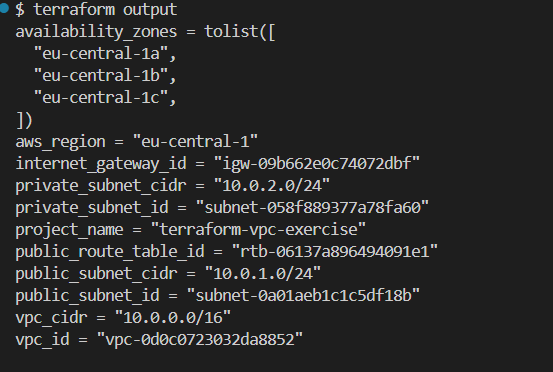
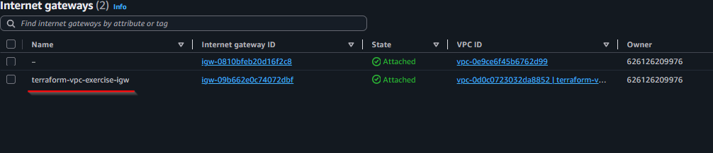
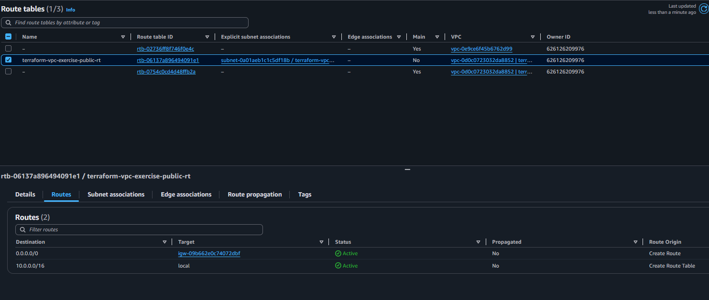
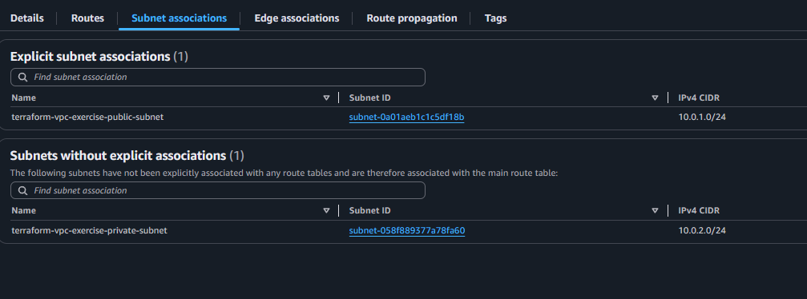

# 🌐 Створення Internet Gateway - Детальні інструкції

## 📋 Огляд кроку

**Мета**: Підключити публічну підмережу до інтернету через Internet Gateway  
**Статус**: ✅ Виконано успішно

---

## 🌐 Що таке Internet Gateway?

**Internet Gateway (IGW)** - це горизонтально масштабований, надмірно резервований та високодоступний компонент VPC, який дозволяє спілкування між інстансами у вашому VPC та інтернетом.

### 🎯 Основні функції IGW:
1. **Двосторонній зв'язок**: Дозволяє як вхідний, так і вихідний інтернет-трафік
2. **NAT для публічних IP**: Автоматично виконує трансляцію мережевих адрес для інстансів з публічними IP
3. **Масштабованість**: Автоматично масштабується без втручання адміністратора
4. **Високий рівень доступності**: Не має єдиної точки відмови

### 🔧 Як працює IGW:
1. **Прикріплюється до VPC** (один IGW на один VPC)
2. **Маршрутизується через Route Table** (маршрут 0.0.0.0/0 → IGW)
3. **Автоматично виконує NAT** для інстансів з публічними IP адресами
4. **Блокує трафік для інстансів без публічних IP**

### 💡 Важливо розуміти:
- IGW **безкоштовний** - плата стягується тільки за передачу даних
- Один VPC може мати **тільки один IGW**
- IGW **не потребує конфігурації** - працює автоматично після прикріплення
- Для роботи потрібні **публічні IP адреси** на інстансах

---

## 🎯 Що досягли

### Створені ресурси:
1. **Internet Gateway**: `igw-09b662e0c74072dbf`
2. **Public Route Table**: `rtb-06137a896494091e1`  
3. **Route Table Association**: `rtbassoc-05c3e3e46ccb8b224`

### Архітектурна схема:
```
┌─────────────────────────────────────────────────────────┐
│                    Internet                             │
└─────────────────────┬───────────────────────────────────┘
                      │
                ┌─────▼─────┐
                │ Internet  │
                │ Gateway   │ igw-09b662e0c74072dbf
                └─────┬─────┘
                      │
┌─────────────────────▼───────────────────────────────────┐
│              VPC (10.0.0.0/16)                          │
│              vpc-0d0c0723032da8852                      │
│                                                         │
│  ┌─────────────────────────────────────────────────┐    │
│  │         Public Subnet (10.0.1.0/24)             │    │
│  │         subnet-0a01aeb1c1c5df18b                │    │
│  │         AZ: eu-central-1a                       │    │
│  │                                                 │    │
│  │  Route Table: rtb-06137a896494091e1             │    │
│  │  Route: 0.0.0.0/0 → igw-09b662e0c74072dbf       │    │
│  └─────────────────────────────────────────────────┘    │
│                                                         │
│  ┌─────────────────────────────────────────────────┐    │
│  │        Private Subnet (10.0.2.0/24)             │    │
│  │        subnet-058f889377a78fa60                 │    │
│  │        AZ: eu-central-1b                        │    │
│  │        (No internet access yet)                 │    │
│  └─────────────────────────────────────────────────┘    │
└─────────────────────────────────────────────────────────┘
```

---

## 💻 Код конфігурації

### 1. Internet Gateway (в internet_gateway.tf):
```hcl
# Internet Gateway для публічного доступу
resource "aws_internet_gateway" "main" {
  vpc_id = aws_vpc.main.id

  tags = {
    Name = "${var.project_name}-igw"
  }
}
```

### 2. Route Table для публічної підмережі:
```hcl
# Route Table для публічної підмережі
resource "aws_route_table" "public" {
  vpc_id = aws_vpc.main.id

  route {
    cidr_block = "0.0.0.0/0"
    gateway_id = aws_internet_gateway.main.id
  }

  tags = {
    Name = "${var.project_name}-public-rt"
  }
}
```

### 3. Association Route Table з підмережею:
```hcl
# Асоціація Route Table з публічною підмережею
resource "aws_route_table_association" "public" {
  subnet_id      = aws_subnet.public.id
  route_table_id = aws_route_table.public.id
}
```

### 4. Outputs (в outputs.tf):
```hcl
# Internet Gateway Outputs
output "internet_gateway_id" {
  description = "ID Internet Gateway"
  value       = aws_internet_gateway.main.id
}

# Route Table Outputs
output "public_route_table_id" {
  description = "ID Route Table для публічної підмережі"
  value       = aws_route_table.public.id
}
```

---

## 🔧 Команди виконання

### 1. Планування змін:
```bash
export AWS_PROFILE=sk-terraform-user
terraform plan -var-file="environments/lab.tfvars"
```
### 2. Застосування змін:
```bash
terraform apply -var-file="environments/lab.tfvars" -auto-approve
```

### 3. Перевірка outputs:
```bash
terraform output
```

**Результат**:
```
internet_gateway_id = "igw-09b662e0c74072dbf"
public_route_table_id = "rtb-06137a896494091e1"
vpc_id = "vpc-0d0c0723032da8852"
public_subnet_id = "subnet-0a01aeb1c1c5df18b"
```



---

## 🔍 Перевірка в AWS Console

### 1. Перевірка Internet Gateway:
- **Перехід**: VPC → Internet Gateways
- **ID**: `igw-09b662e0c74072dbf`
- **Статус**: Attached to `vpc-0d0c0723032da8852`



### 2. Перевірка Route Table:
- **Перехід**: VPC → Route Tables
- **ID**: `rtb-06137a896494091e1`
- **Routes**: 
  - `10.0.0.0/16` → local
  - `0.0.0.0/0` → `igw-09b662e0c74072dbf`



### 3. Перевірка Subnet Associations:
- **Route Table**: `rtb-06137a896494091e1`
- **Associated Subnets**: `subnet-0a01aeb1c1c5df18b` (Public)



---

## ✅ Результат

### Що досягнуто:
1. ✅ **Internet Gateway створено та підключено** до VPC
2. ✅ **Route Table налаштовано** для публічної підмережі  
3. ✅ **Маршрутизація налаштована** (0.0.0.0/0 → IGW)
4. ✅ **Публічна підмережа отримала доступ до інтернету**

### Наступний крок:
🔀 **Крок 5**: Створення NAT Gateway для приватної підмережі

---

## 🔗 Корисні посилання

- [AWS Internet Gateway Documentation](https://docs.aws.amazon.com/vpc/latest/userguide/VPC_Internet_Gateway.html)
- [Terraform aws_internet_gateway](https://registry.terraform.io/providers/hashicorp/aws/latest/docs/resources/internet_gateway)
- [AWS Route Tables Guide](https://docs.aws.amazon.com/vpc/latest/userguide/VPC_Route_Tables.html)