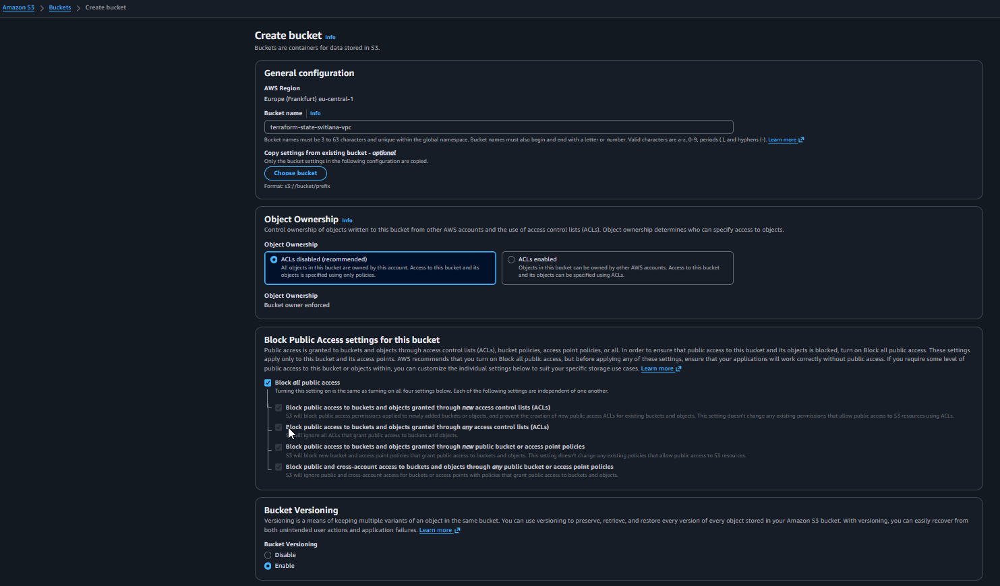
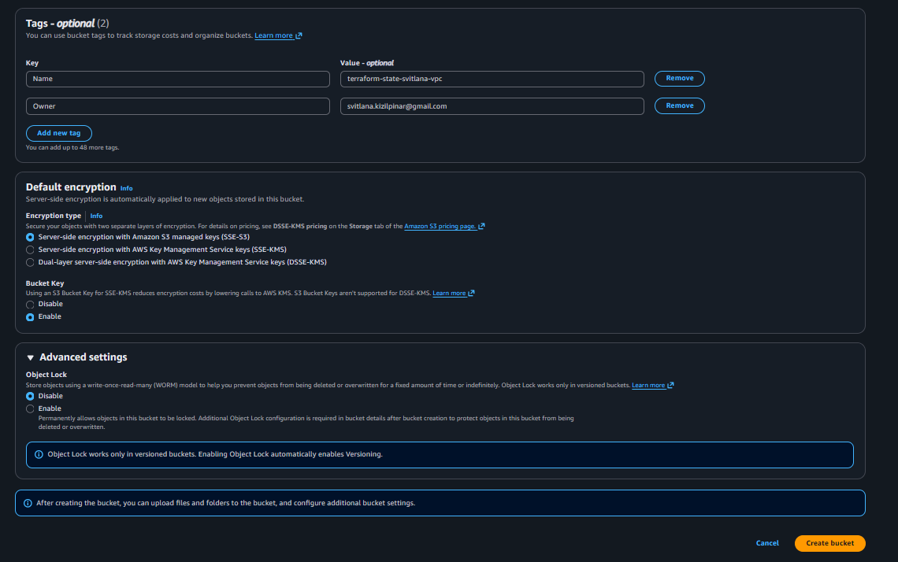
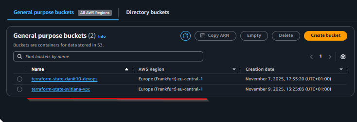

# 📦 S3 Backend для Terraform State

## Чому важливий S3 Backend?

### Проблеми локального tfstate:
- 🚫 Файл зберігається тільки на вашому комп'ютері
- 🚫 Неможлива командна робота
- 🚫 Ризик втрати при поломці диска
- 🚫 Відсутність версіонування та бекапів

### Переваги S3 Backend:
- ✅ Централізоване збереження state
- ✅ Автоматичне версіонування  
- ✅ Шифрування даних
- ✅ Блокування state (через DynamoDB)
- ✅ Можливість командної роботи

### 1. S3 Bucket (`terraform-state-svitlana-vpc`)
- Збереження tfstate файлу
- Версіонування увімкнено
- Шифрування AES256
- Заблоковано публічний доступ
- Захист від видалення

### 2. DynamoDB таблиця (`terraform-state-locks`)
- Блокування state під час операцій
- Запобігає конфліктам при паралельній роботі
- Billing mode: PAY_PER_REQUEST (платите тільки за використання)

## 🎯 **Навчальна цінність S3 Backend:**

### Для цього проекту:
✅ **Рекомендовано**: S3 backend забезпечує:
- Безпечне збереження Terraform state
- Можливість відновлення після помилок
- Професійний підхід до Infrastructure as Code

### Для production:
🏆 **Обов'язково**: S3 backend + DynamoDB locks:
- Командна робота без конфліктів
- Автоматичне версіонування змін
- Резервне копіювання state файлів

## Порядок роботи:

### Крок 1: Створення S3 Bucket через AWS Console

**🎯 Мета**: Створити S3 bucket для збереження Terraform state файлів

#### Варіант A: Створення через AWS Console (рекомендовано для навчання)

1. **Відкрийте AWS S3 Console**: [https://s3.console.aws.amazon.com/](https://s3.console.aws.amazon.com/)

2. **Створіть новий bucket**:
   - Натисніть **"Create bucket"**
   - **Bucket name**: `terraform-state-svitlana-vpc` (унікальна назва)
   - **Region**: `eu-central-1` (Frankfurt)

   

3. **Налаштуйте параметри безпеки**:
   - **Block all public access**: ✅ (обов'язково!)
   - **Bucket Versioning**: Enable (рекомендовано)
   - **Server-side encryption**: Enable (AES-256)

   

4. **Завершіть створення**:
   - Перевірте всі налаштування
   - Натисніть **"Create bucket"**

   

#### Варіант B: Створення через Terraform
```bash
# Спочатку створюємо S3
# Тимчасово закоментуйте секцію backend в main.tf

terraform init
terraform plan -var-file="environments/lab.tfvars"
terraform apply -var-file="environments/lab.tfvars"
```

### Крок 2: Налаштування Terraform backend

#### 📝 Оновіть main.tf з S3 backend конфігурацією:

```hcl
terraform {
  required_version = ">= 1.0"
  
  backend "s3" {
    bucket = "terraform-state-svitlana-vpc"
    key    = "terraform/terraform.tfstate"
    region = "eu-central-1"
    
    # Опціонально: для блокування state
    # dynamodb_table = "terraform-state-locks"
    # encrypt        = true
  }
  
  required_providers {
    aws = {
      source  = "hashicorp/aws"
      version = "~> 5.0"
    }
  }
}
```

### Крок 3: Міграція на S3 backend
```bash
# Розкоментуйте backend секцію в main.tf
terraform init
# Terraform запропонує перенести існуючий state в S3
# Відповідьте "yes"
```

### Крок 4: Перевірка
```bash
# Перевірте що state тепер в S3
aws s3 ls s3://terraform-state-svitlana-vpc/terraform/
```

## Безпека:

⚠️ **ВАЖЛИВО**:
- Ніколи не коммітьте tfstate файли в git
- S3 bucket повинен бути приватним
- Використовуйте IAM права для обмеження доступу
- Регулярно робіть бекапи

## Troubleshooting:

### Помилка "bucket doesn't exist":
```bash
# Переконайтеся що bucket створений
aws s3 ls | grep terraform-state

# Створіть bucket якщо потрібно
aws s3 mb s3://terraform-state-svitlana-vpc --region eu-central-1
```

### Помилка "DynamoDB table doesn't exist":
```bash
# Перевірте таблицю
aws dynamodb list-tables --region eu-central-1
```

## 🧹 **Cleanup після проекту:**

### Видалення S3 Backend:
1. **Спочатку**: `terraform destroy` (видаляє всі ресурси)
2. **Потім**: Видаліть S3 bucket через AWS Console
3. **Якщо є DynamoDB**: Видаліть таблицю `terraform-state-locks`

⚠️ **ВАЖЛИВО**: Завжди спочатку `terraform destroy`, потім видаляйте backend!

---

## 📸 **Скріншоти процесу:**
- [3.1 - Початок створення bucket](../Screens/3.1_create_bucket.png)
- [3.2 - Налаштування параметрів](../Screens/3.2_create_bucket.png)  
- [3.3 - Результат створення](../Screens/3.3_create_bucket.png)

---

**Наступний крок**: Після налаштування backend створюємо VPC інфраструктуру.